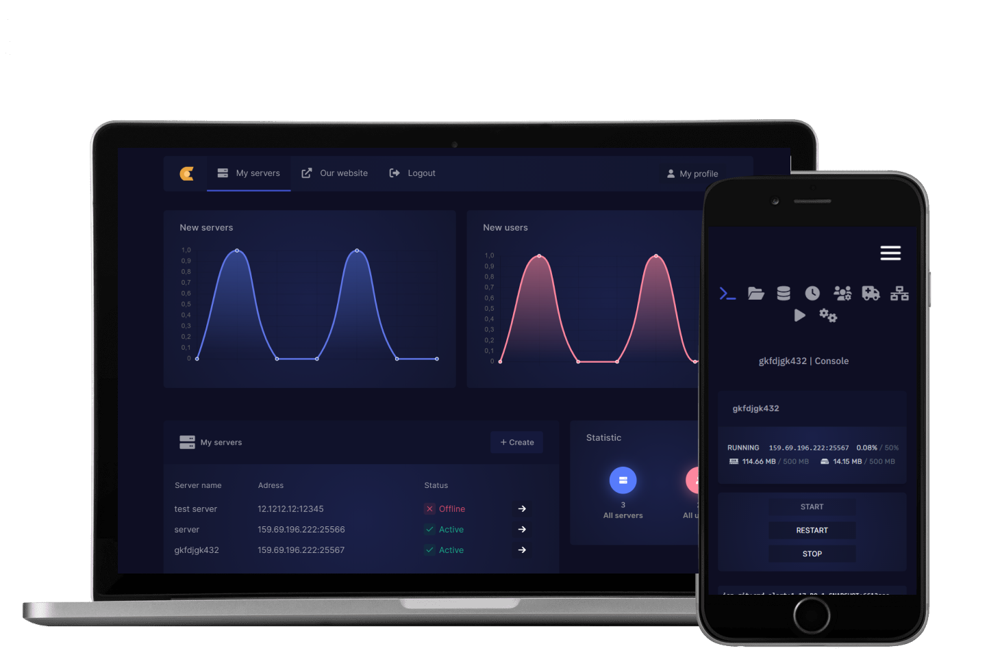

# Pterodactyl - Custom



> Painel de controle Pterodactyl customizado com tema Dark Blue.

### Novidades no tema

- [x] Otimizado
- [x] Tema Dark
- [x] Administração ultra

## 💻 Pré-requisitos

Antes de querer instalar tenha os requisitos abaixo!

* Você instalou a versão mais recente do `<Pterodactyl>`
* Tenha uma maquina `<Linux>`.
* Ler a instalação abaixo.

## 🚀 Instalação do tema

Para instalar o <Pterodactyl-custom>, siga estas etapas:

Linux:


1. Descompacte o arquivo
2. Crie um backup do seu painel:
   ```sh
   tar -cvf panel.tar.gz /var/www/pterodactyl
   ```
3. Pegue as duas pastas, carregue tudo para a pasta pterodactyl (por padrão: /var/www/pterodactyl)
4. Monte seu painel. Para fazer isso, escreva estes comandos:
```sh
curl -sL https://deb.nodesource.com/setup_14.x | sudo -E bash -
apt install -y nodejs
apt install npm
npm i -g yarn
yarn install
cd /var/www/pterodactyl && yarn build:production```
  ```
  
Caso tenha mais duvidas, veja?: https://pterodactyl.io/community/customization/panel.html

5. Feito! Recarregue a página limpando o cache (CTRL + R)
